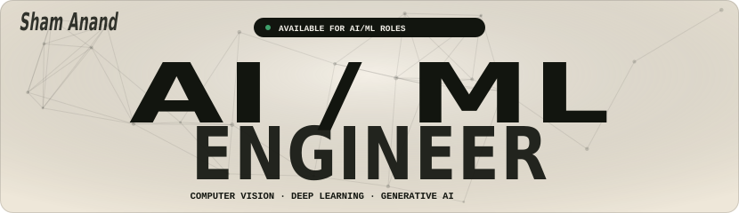
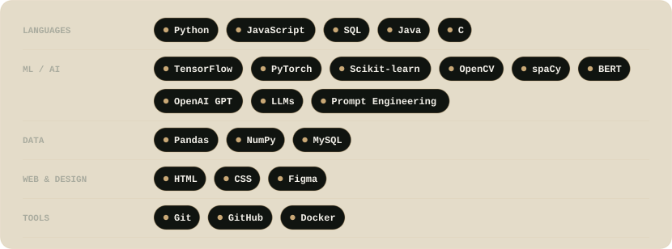
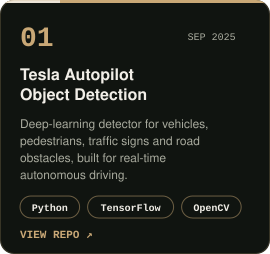
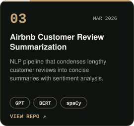
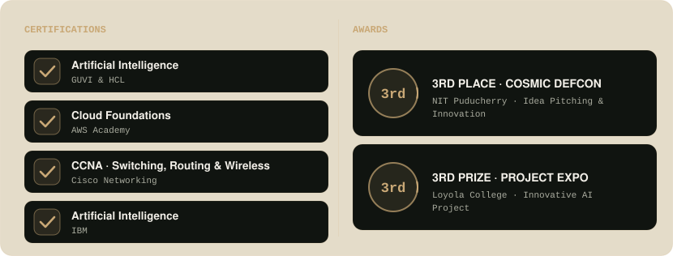
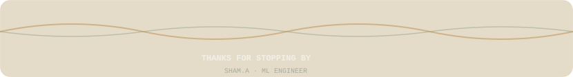

<!-- Instagram: uncomment and put YOUR profile link below

-->

  

Forward-thinking engineer with a love for interactive web creation, an intense interest in algorithmic intelligence,
and a gift for creative problem resolution. 
I reshape ideas into adaptive, insightful, and polished digital solutions.

<!-- Replace each link below with the exact repo URL of that project -->
<table align="center" width="100%">
<tr>
<td width="33%" align="center"></td>
<td width="33%" align="center"></td>
<td width="33%" align="center"></td>
</tr>
</table>

